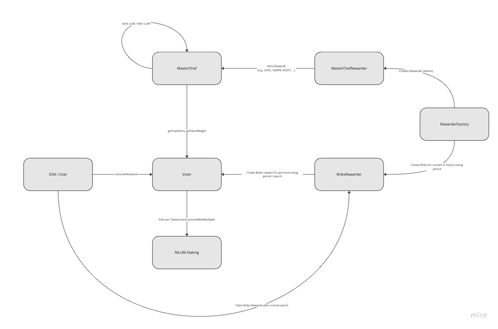

## MagicSea Staking

Repo for the MagicSea staking contracts

- Mlum Staking: Staking contract for staking MLUM and earn stable rewards like USDC.
- MasterChef: Farming contract for get liquidity mining rewards. The contracts get the top farms from voter. 
     - It has an option to mint or just to emit LUM
     - LUM will not be minted on IotaEVM for the first Time
     - LUM will get transfered from ShimmerEVM to IotaEVM MasterChef via OFT standard
     - If ShimmerEVM will be abondanded in the long future, MasterChef will mint the LUM
- Voter: Voting contract for voting on Uniswap V2 and LB pairs. Voters need a MLUM staking position.
- RewardFactory: Factory for creating MasterChefRewarders and BribeRewarders
    - MasterChefRewarders: Extra Rewarders for dual token rewards on farms
    - BribeRewarders: Bribe pools (V2 / LB) for getting votes
- Booster: Booster contract for refining LUM to MLUM

Here is an simplified overview of the dependencies of the above contracts (except booster):




## Documentation

https://book.getfoundry.sh/

## Usage

### Build

```shell
$ forge build
```

### MasterChef keeper dependencies

```shell
$ yarn
```

### FeeSender

build docker
```
docker build --no-cache -t fee_sender .
```

run fee sender script:

```
docker run --env-file .env fee_sender --rpc-url ${RPC_SHIMMER_TESTNET_URL} --legacy
```


### Cast

```shell
$ cast <subcommand>
```

### Help

```shell
$ forge --help
$ anvil --help
$ cast --help
```
